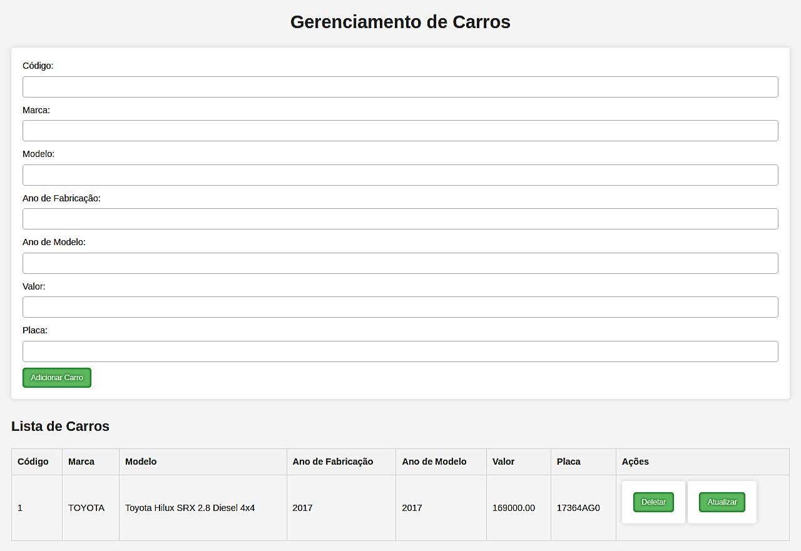

# Sistema de cadastro de carros com PHP e banco de dados

## 🚀 Introdução
Um sistema PHP para cadastro de veículos com armazenamento em um banco de dados.
Um projeto criado com o intuito de colocar em prática habilidades de conexão e interação com o banco de dados utilizando PHP. 

### Visualização da página do sistema de cadastro

## 📦 Tecnologias usadas

Visual Studio Code: É um editor de código desenvolvido pela Microsoft para Windows, Linux e macOS.

HTML: É uma linguagem de marcação utilizada para construir páginas da web.

CSS: É um mecanismo para adicionar estilos a uma página da web.

PHP: É uma linguagem de programação utilizada para construir sites dinâmicos, extensões de integração de aplicações e também para agilizar no desenvolvimento de um sistema.

MySQL: Sistema de Gerenciamento de banco de dados, que utiliza linguagem SQL como interface.

Apache: É um servidor web livre e de código aberto.
